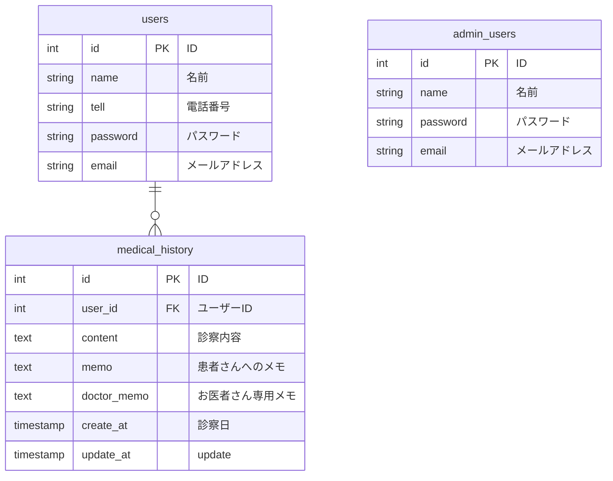

```mermaid
erDiagram
    users {
        int id PK "ID"
        string name "名前"
        string tell "電話番号"
        string password "パスワード"
        string email "メールアドレス"
    }

    

    medical_history{
        int id PK "ID"
        int user_id FK "ユーザーID"
        text content "診察内容"
        text memo "患者さんへのメモ"
        text doctor_memo "お医者さん専用メモ"
        timestamp create_at "診察日"
        timestamp update_at "update" 
    }

    admin_users{
        int id PK "ID"
        string name "名前"
        string password "パスワード"
        string email "メールアドレス"
    }

    users ||--o{ medical_history: ""
```
