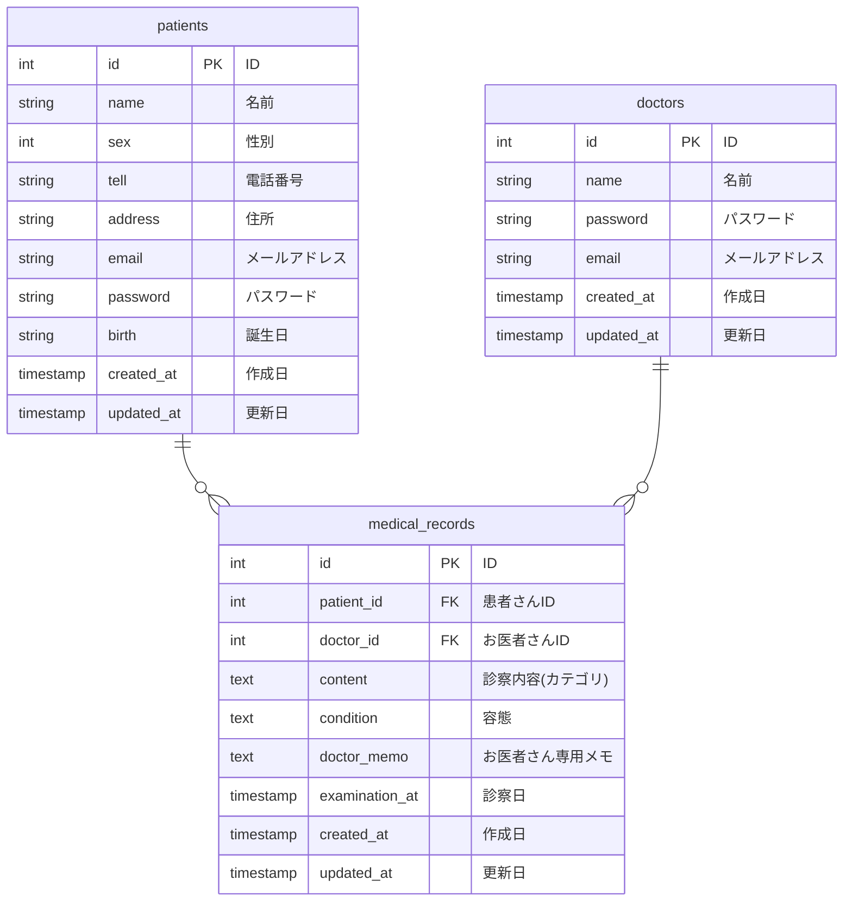

```mermaid
erDiagram
    patients {
        int id PK "ID"
        string name "名前"
        int sex "性別"
        string tell "電話番号"
        string address "住所"
        string email "メールアドレス"
        string password "パスワード"
        string birth "誕生日"
        timestamp created_at "作成日"
        timestamp updated_at "更新日"
        %% timestamp last_hospital_visit_at "最新来院日"
    }

    medical_records{
        int id PK "ID" 
        int patient_id FK "患者さんID"
        int doctor_id FK "お医者さんID"
        text content "診察内容(カテゴリ)"
        text condition "容態"
        text doctor_memo "お医者さん専用メモ"
        timestamp examination_at "診察日"
        timestamp created_at "作成日"
        timestamp updated_at "更新日"
        %% int deleted_flag "削除"
    }

    %% 診察（施術内容をカテゴリ化してテーブル）
    

    doctors{
        int id PK "ID" 
        string name "名前"
        string password "パスワード"
        string email "メールアドレス"
        timestamp created_at "作成日"
        timestamp updated_at "更新日" 
    }

    patients ||--o{ medical_records: ""
    doctors ||--o{ medical_records: ""
```
