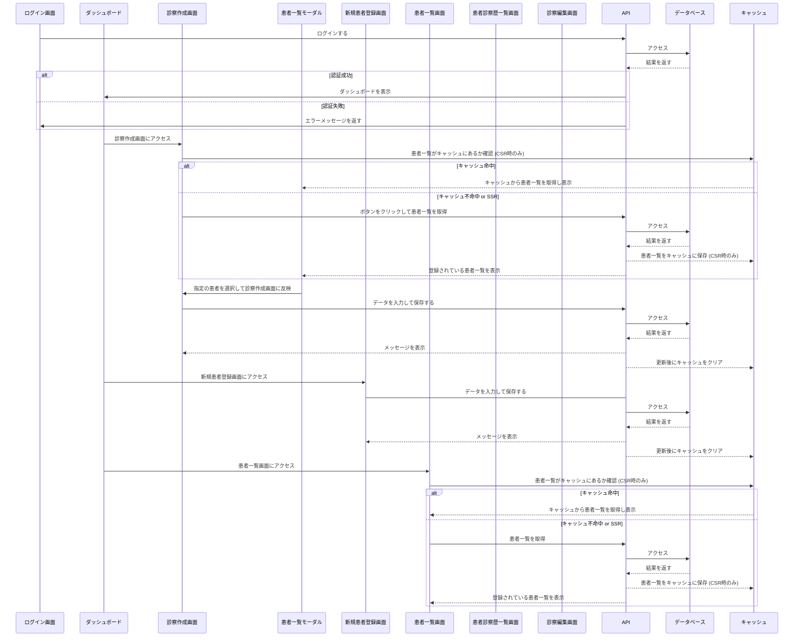

```mermaid
sequenceDiagram
    participant ログイン画面
    participant ダッシュボード
    participant 診察作成画面
    participant 患者一覧モーダル
    participant 新規患者登録画面
    participant 患者一覧画面
    participant 患者診察歴一覧画面
    participant 診察編集画面
    participant API
    participant データベース
    participant キャッシュ

    ログイン画面->>API:ログインする
    API->>データベース:アクセス
    データベース-->>API:結果を返す

    alt 認証成功
        API->>ダッシュボード:ダッシュボードを表示
    else 認証失敗
        API->>ログイン画面:エラーメッセージを返す
    end

    ダッシュボード->>診察作成画面:診察作成画面にアクセス
    診察作成画面->>キャッシュ:患者一覧がキャッシュにあるか確認 (CSR時のみ)
    alt キャッシュ命中
        キャッシュ-->>患者一覧モーダル:キャッシュから患者一覧を取得し表示
    else キャッシュ不命中 or SSR
        診察作成画面->>API:ボタンをクリックして患者一覧を取得
        API->>データベース:アクセス
        データベース-->>API:結果を返す
        API-->>キャッシュ:患者一覧をキャッシュに保存 (CSR時のみ)
        API-->>患者一覧モーダル:登録されている患者一覧を表示
    end
    患者一覧モーダル->>診察作成画面:指定の患者を選択して診察作成画面に反映

    診察作成画面->>API:データを入力して保存する
    API->>データベース:アクセス
    データベース-->>API:結果を返す
    API-->>診察作成画面:メッセージを表示
    API-->>キャッシュ:更新後にキャッシュをクリア

    ダッシュボード->>新規患者登録画面:新規患者登録画面にアクセス
    新規患者登録画面->API:データを入力して保存する
    API->>データベース:アクセス
    データベース-->>API:結果を返す
    API-->>新規患者登録画面:メッセージを表示
    API-->>キャッシュ:更新後にキャッシュをクリア

    ダッシュボード->>患者一覧画面:患者一覧画面にアクセス
    患者一覧画面->>キャッシュ:患者一覧がキャッシュにあるか確認 (CSR時のみ)
    alt キャッシュ命中
        キャッシュ-->>患者一覧画面:キャッシュから患者一覧を取得し表示
    else キャッシュ不命中 or SSR
        患者一覧画面->>API:患者一覧を取得
        API->>データベース:アクセス
        データベース-->>API:結果を返す
        API-->>キャッシュ:患者一覧をキャッシュに保存 (CSR時のみ)
        API-->>患者一覧画面:登録されている患者一覧を表示
    end
```
