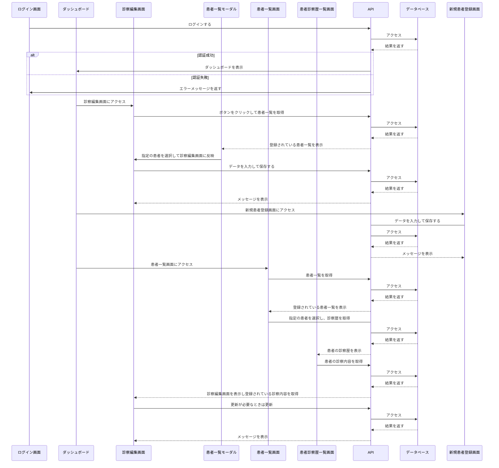

---
title:管理画面の導線
---

```mermaid
sequenceDiagram
    participant ログイン画面
    participant ダッシュボード
    participant 診察編集画面
    participant 患者一覧モーダル
    participant 診察編集画面
    participant 患者一覧画面
    participant 患者診察歴一覧画面
    participant API
    participant データベース
   
    ログイン画面->>API:ログインする
    API->>データベース:アクセス
    データベース-->>API:結果を返す

    alt 認証成功
        API->>ダッシュボード:ダッシュボードを表示
    else 認証失敗
        API->>ログイン画面:エラーメッセージを返す
    end

    ダッシュボード->>診察編集画面:診察編集画面にアクセス
    診察編集画面->>API:ボタンをクリックして患者一覧を取得
    API->>データベース:アクセス
    データベース-->>API:結果を返す
    API-->>患者一覧モーダル:登録されている患者一覧を表示
    患者一覧モーダル->>診察編集画面:指定の患者を選択して診察編集画面に反映

    診察編集画面->>API:データを入力して保存する
    API->>データベース:アクセス
    データベース-->>API:結果を返す
    API-->>診察編集画面:メッセージを表示

    ダッシュボード->>新規患者登録画面:新規患者登録画面にアクセス
    新規患者登録画面->API:データを入力して保存する
    API->>データベース:アクセス
    データベース-->>API:結果を返す
    API-->>新規患者登録画面:メッセージを表示

     ダッシュボード->>患者一覧画面:患者一覧画面にアクセス
     患者一覧画面->>API:患者一覧を取得
    API->>データベース:アクセス
    データベース-->>API:結果を返す
    API-->>患者一覧画面:登録されている患者一覧を表示
    患者一覧画面->API:指定の患者を選択し、診察歴を取得
    API->>データベース:アクセス
    データベース-->>API:結果を返す
    API-->>患者診察歴一覧画面:患者の診察歴を表示
    患者診察歴一覧画面->>API:患者の診察内容を取得
      API->>データベース:アクセス
    データベース-->>API:結果を返す
    API-->>診察編集画面:診察編集画面を表示し登録されている診察内容を取得
    診察編集画面->>API:更新が必要なときは更新
      API->>データベース:アクセス
    データベース-->>API:結果を返す
     API-->>診察編集画面:メッセージを表示
```
